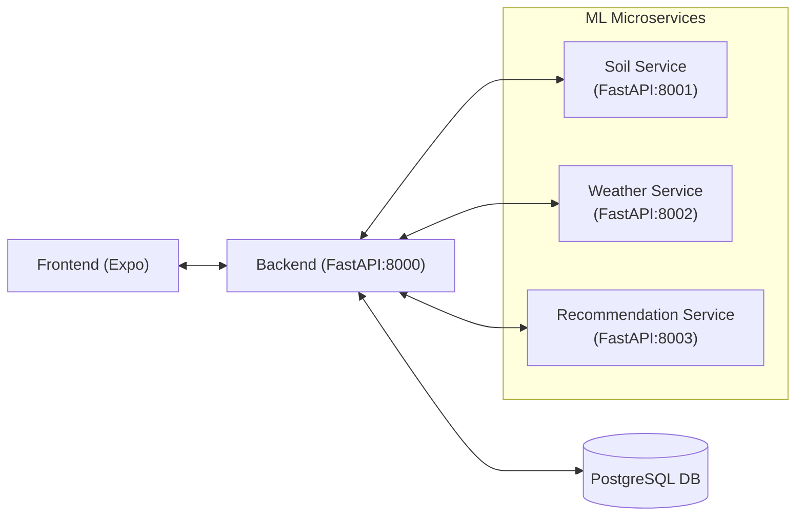

# ARICE Machine Learning Services

Machine Learning microservices for the ARICE (Agricultural Rice Information and Consulting Expert) project.

This folder contains multiple FastAPI services (Soil, Weather, Recommendation) that are consumed by the Backend. The Frontend never calls these services directly.

## What’s In Here

- **Soil Service**: soil health scoring, hybrid soil forecasting, forecast realignment
- **Weather Service**: weather forecast + historical analysis endpoints
- **Recommendation Service**: rice variety recommendations + planting schedule

## Architecture (Microservices)



Notes:
- Ports `8002` and `8003` are present in `docker-compose.yml` but currently commented out.
- Each service has its own FastAPI app entrypoint under `apps/*_service/main.py`.

## Services

| Service | Entry point | Default port | Base path prefix |
|---------|------------|--------------|------------------|
| Soil | `apps/soil_service/main.py` | 8001 | `/api/v1/soil` |
| Weather | `apps/weather_service/main.py` | 8002 | `/api/v1/weather` |
| Recommendation | `apps/recommendation_service/main.py` | 8003 | `/api/v1/recommendation` |

### Soil Service Endpoints

- `GET /health`
- `POST /api/v1/soil/analyze`
- `POST /api/v1/soil/health-score-detailed`
- `POST /api/v1/soil/hybrid-forecast`
- `POST /api/v1/soil/realign-forecast`
- `GET /api/v1/soil/status`

Implementation reference:
- Hybrid soil model: `apps/soil_service/models/hybrid_forecast_model.py`
- Soil API routes: `apps/soil_service/api/endpoints.py`

### Weather Service Endpoints

- `GET /health`
- `POST /api/v1/weather/forecast`
- `POST /api/v1/weather/historical`
- `GET /api/v1/weather/current/{latitude}/{longitude}`
- `GET /api/v1/weather/status`

### Recommendation Service Endpoints

- `GET /health`
- `POST /api/v1/recommendation/varieties` (get recommendations)
- `GET /api/v1/recommendation/varieties` (list varieties)
- `GET /api/v1/recommendation/varieties/{variety_id}`
- `POST /api/v1/recommendation/planting-schedule`
- `GET /api/v1/recommendation/status`

## Repository Layout

This is the current structure (matches the implementation under `apps/`).

```
machine_learning/
├── apps/
│   ├── common/                     # Shared base classes, utils, validators, schemas
│   ├── config/                     # Shared settings (project-wide defaults)
│   ├── middleware/                 # Shared middleware (rate limit, logging, errors)
│   ├── soil_service/
│   │   ├── api/                    # Routers + request/response schemas
│   │   ├── core/                   # Service config/constants
│   │   ├── models/                 # ML models + soil domain logic
│   │   ├── services/               # Use cases/orchestration (calls models)
│   │   └── tests/
│   ├── weather_service/
│   │   ├── api/
│   │   ├── core/
│   │   ├── models/
│   │   ├── services/
│   │   └── tests/
│   └── recommendation_service/
│       ├── api/
│       ├── core/
│       ├── models/
│       ├── services/
│       └── tests/
├── data/                           # Datasets
├── trained_models/                 # Model artifacts (joblib, etc.)
├── docs/                           # Documentation (e.g., hybrid soil model explanation)
├── notebooks/                      # Experiment notebooks
├── scripts/                        # Training/utility scripts (some legacy)
├── tests/                          # Cross-service tests
├── Dockerfile
└── requirements.txt
```

## DDD Mapping (Practical)

We use a DDD-inspired separation inside each service:

- **Interfaces (API layer)**: `apps/*_service/api`, plus `apps/*_service/main.py`
- **Application (use cases)**: `apps/*_service/services`
- **Domain (models + rules)**: `apps/*_service/models` (and some constants under `apps/*_service/core`)
- **Infrastructure**: `trained_models/`, `data/`, plus any external adapters in `apps/*_service/core` / `apps/common/utils`
- **Shared Kernel**: `apps/common`, `apps/middleware`, `apps/config`

## Running Locally

Prereqs: Python + dependencies from `requirements.txt`.

```powershell
cd machine_learning
python -m venv .venv
.venv\Scripts\activate
pip install -r requirements.txt
```

Run a service (example: Soil):

```powershell
cd machine_learning
$env:MODEL_PATH = "./trained_models/soil"
uvicorn apps.soil_service.main:app --reload --host 0.0.0.0 --port 8001
```

Run Weather:

```powershell
cd machine_learning
$env:MODEL_PATH = "./trained_models/weather"
uvicorn apps.weather_service.main:app --reload --host 0.0.0.0 --port 8002
```

Run Recommendation:

```powershell
cd machine_learning
$env:MODEL_PATH = "./trained_models/recommendation"
uvicorn apps.recommendation_service.main:app --reload --host 0.0.0.0 --port 8003
```

## Running With Docker Compose (Recommended)

The root `docker-compose.yml` defines `ml-soil` (enabled) and templates for `ml-weather` and `ml-recommendation` (commented). Start the stack from the repo root:

```bash
docker compose up --build
```

## Configuration

Common environment variables used by services:

```
MODEL_PATH=./trained_models/soil
PYTHONPATH=./
```

Each service defaults `MODEL_PATH` to its own folder:
- Soil: `./trained_models/soil`
- Weather: `./trained_models/weather`
- Recommendation: `./trained_models/recommendation`

## Model Artifacts

- Soil artifacts: `trained_models/soil/`
- Weather artifacts: `trained_models/weather/`
- Recommendation artifacts: `trained_models/recommendation/`

## Documentation
- Documentation for each Machine Learning

## Testing

```bash
pytest
pytest machine_learning/tests -v
```

## Notes on Training Scripts

`scripts/` contains training/utilities. Some scripts still reference a legacy `app/` package and may require updating before use.

For model logic, prefer the service models directly:
- Soil: `apps/soil_service/models/*`
- Weather: `apps/weather_service/models/*`
- Recommendation: `apps/recommendation_service/models/*`

## License

ARICE Thesis Project - Wonderpets Team
